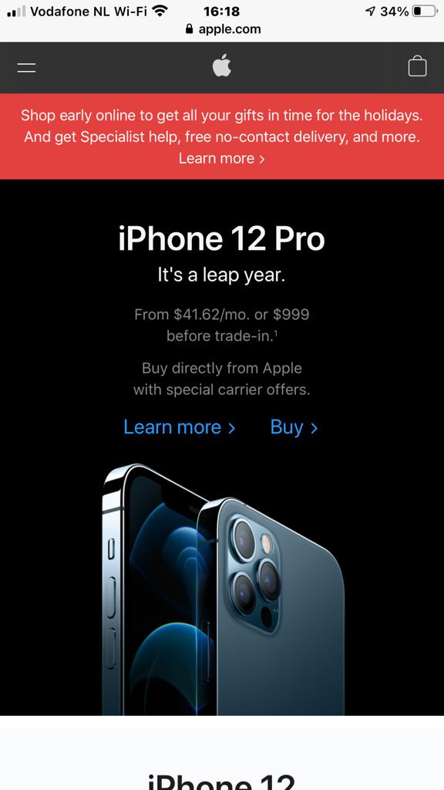

# Procesverslag
**Auteur:** Yunus Emre Alkan

Markdown cheat cheet: [Hulp bij het schrijven van Markdown](https://github.com/adam-p/markdown-here/wiki/Markdown-Cheatsheet). Nb. de standaardstructuur en de spartaanse opmaak zijn helemaal prima. Het gaat om de inhoud van je procesverslag. Besteedt de tijd voor pracht en praal aan je website.

## Bronnenlijst
1. https://www.apple.com/
2. https://css-tricks.com/almanac/properties/b/backdrop-filter/
3. https://www.w3schools.com/cssref/tryit.asp?filename=trycss3_gen_sibling
4. https://stackoverflow.com/questions/9943771/adding-a-favicon-to-a-static-html-page
5. https://codepen.io/shooft/pen/jOMOroZ

## Eindgesprek (week 7/8)

-dit ging goed & dit was lastig-

**Screenshot(s):**

## Voortgang 3 (week 6)

Voortgangsgesprek ging goed, geen opmerkingen. Ik ben verder gegaan met pagina 2.

## Voortgang 2 (week 5)

Voortgangsgesprek ging goed, weinig dat fout ging, ik had articles en sections door elkaar gehaald daar kreeg ik kritiek op (naja kritiek, dat was een minpunt), dus dat heb ik gefixt. Ook een klein begin gemaakt aan pagina 2.

## Voortgang 1 (week 3)

### Stand van zaken

Er was niet zo zeer iets lastig, ik ben eerst begonenne met het maken van breakdown-schetsen en daarna ben ik langzamerhand begonnen met het maken van de eerste pagina.

**Screenshot(s):**

-screenshot(s) van hoe ver je bent met korte uitleg-

### Agenda voor meeting

-samen met je groepje opstellen-

| student 1      | student 2          | student 3    | student 4        |
| ---            | ---                | ---          | ---              |
| dit bespreken  | en dit             | en ik dit    | en dan ik dat    |
| an dat ook nog | dit als er tijd is | nog een punt | dit wil ik zeker |
| ...            | ...                | ...          | ...              |

### Verslag van meeting

-na afloop snel uitkomsten vastleggen-

## Breakdownschets (week 1)

Het is mij niet gelukt om het hier als PNG neer te zetten :(
Dus check mijn breakdownpagina :) <a href="https://yunusemrecmd.github.io/blokweb/breakdownschets.html">Breakdown Schets Apple Homepage</a>

## Intake (week 1)
-uitwerken voor de kick-off werkgroep - begin van de eerste week-

**Je startniveau:** Zwart (Ben eignlk rood, maar ik sta open voor een uitdaging :)

**Je focus:** Ik ga de website responsive maken, en proberen ook meer aandacht te besteden aan de surface laag

**Je opdracht:** <a href="https://www.apple.com/">Apple.com</a>

**Screenshot(s) van de eerste pagina (small screen):**

**Screenshot(s) van de tweede pagina (small screen):**

